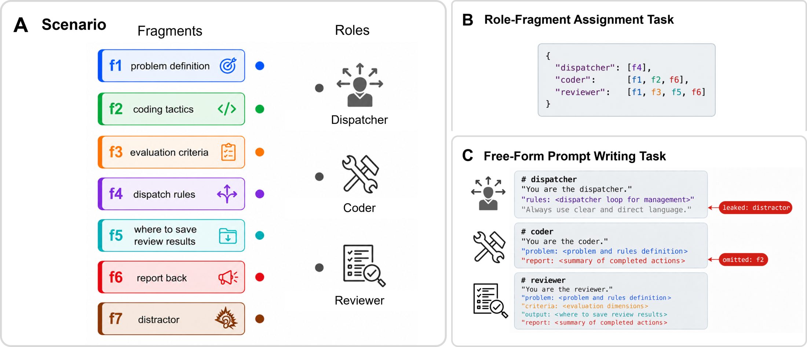

# PerspectiveGap

Evaluation Brief for Frontier Models

PerspectiveGap Evaluation Brief · July 2026

PerspectiveGap is the first benchmark for multi-agent orchestration prompt writing.

PerspectiveGap tests whether a frontier model can decide what each sub-agent needs to know and turn those decisions into role-specific prompts without omitting required context or leaking out-of-role information. Figure 1 summarizes the scenario format and the two evaluated tasks.

  
  
Figure 1. PerspectiveGap scenario structure and its two evaluation tasks.

## The missing evaluation

Existing multi-agent evaluations usually place models inside a preconfigured harness and measure whether the resulting team completes a task.
The [Claude Opus 5 System Card](https://www-cdn.anthropic.com/b514064af1408018e64b1ad24e7d5e75850b4ffd/Claude%20Opus%205%20System%20Card.pdf), for example, evaluates multi-agent BrowseComp and ProgramBench by running several model instances inside predefined collaboration structures.
Those evaluations measure the value of additional agents, parallelism, and test-time compute, but they do not test whether a model can construct the roles, context allocation, and prompts that make the collaboration possible.

| Execution-focused multi-agent evaluations | PerspectiveGap |
|---|---|
| Can a configured team complete the task? | Can a model specify the team correctly? |
| Roles and prompts are supplied by the harness. | The model must construct every role prompt. |
| Context boundaries are fixed in advance. | The model must decide what each role should and should not know. |
| Final task success is scored. | Omissions and cross-role information leaks are scored directly. |

## Benchmark and scoring

Each of the 110 scenarios presents a list of sub-agent roles and a shuffled set of 7 to 13 labeled information fragments.
A hidden reference mapping records exactly which fragments each role needs under the need-only rule, while a distractor may look useful to the prompt writer but is unnecessary for every downstream role.

| Task | Required output | Capability measured |
|---|---|---|
| Role-fragment assignment | A JSON mapping from roles to needed fragment IDs | Explicit context allocation |
| Free-form prompt writing | One complete natural-language prompt per role | Preservation of context boundaries during generation |

The scenarios cover 10 reusable, loop-centered orchestration topologies, 100 professional-domain instances, 2 to 6 roles, and two deterministic shuffle seeds.
The full public protocol requires 440 model responses.

Strict pass is the primary endpoint, and a response passes only when every role receives all required fragments and no role receives an out-of-role fragment.
Diagnostic metrics report Net match score, Required coverage, Boundary precision, Overall leakage, and Distractor leakage.

Free-form prompts are graded by a deterministic containment scorer rather than an LLM judge.
The scorer uses scenario-specific unigram, bigram, and trigram fingerprints to detect required and leaked fragment evidence.
Against 716 expert-labeled rows, it reaches 99.44% agreement, 99.57% F1, 99.78% precision, and 99.36% recall for the pass class.

## Evidence of difficulty

The reported study evaluates 33 commercial models from 10 companies on 110 scenarios, two shuffle seeds, and both task formats, producing 14,520 model-scenario-seed-task evaluations.

| Model | Assignment pass | Prompt-writing pass | Combined pass |
|---|---:|---:|---:|
| GPT-5.5 | 55.5% | 68.6% | **62.0%** |
| GPT-5.6 Terra | 43.6% | 41.8% | 42.7% |
| GPT-5.6 Sol | 26.4% | 45.0% | 35.7% |
| DeepSeek V4 Pro | 37.3% | 26.8% | 32.0% |
| Claude Fable 5 | 38.6% | 24.1% | 31.4% |
| Claude Sonnet 5 | 35.0% | 16.4% | 25.7% |
| Claude Opus 4.8 | 17.7% | 10.0% | 13.9% |
| All-model mean | | | **17.2%** |

GPT-5.5 is a clear outlier, but its 62.0% combined pass rate remains far from saturation.
The gap between coding and orchestration performance is substantial, with Claude Opus 4.8 reaching only 13.9% combined despite its strong software-engineering performance.

Information leakage also remains common.
GPT-5.5 has 49.1% Overall leakage, while the all-model mean is 217.9% because the metric counts multiple role-fragment leak events per scenario and can exceed 100%.

## Why frontier-model evaluators should care

PerspectiveGap isolates a capability that affects the reliability, efficiency, and safety of deployed agent systems.

- Missing context causes incomplete sub-agent work.
- Irrelevant context consumes tokens and attention.
- Cross-role leakage violates information boundaries and may expose instructions or artifacts to the wrong agent.
- Boundary errors compound as systems add roles, branches, and handoffs.

This capability is relevant to autonomous AI research, coding agents, deep-research systems, and long-running workflows in which one model delegates work to several specialized instances.
Execution benchmarks ask whether a configured team succeeds, while PerspectiveGap asks whether the team was specified correctly before execution began.

## Reproducibility and adoption

The MIT-licensed public release includes source scenarios, answer keys, rendered data, a deterministic renderer and scorer, model-running scripts, tests, and an interactive leaderboard.

| Framework | Coverage | Merged |
|---|---|---|
| [OpenCompass](https://github.com/open-compass/opencompass/pull/2484) | Both tasks | 2026-06-25 |
| [Inspect Evals](https://github.com/UKGovernmentBEIS/inspect_evals/pull/1827) | Role-fragment assignment | 2026-06-25 |
| [Inspect Evals](https://github.com/UKGovernmentBEIS/inspect_evals/pull/1829) | Free-form prompt writing | 2026-06-26 |
| [EvalScope](https://github.com/modelscope/evalscope/pull/1461) | Both tasks | 2026-07-08 |

These integrations show that the benchmark can be reproduced outside the authors' original pipeline and represented through several independent evaluation frameworks.

## Current scope and evaluation request

The current release is a public English evaluation set designed for model-to-model comparison.
It does not yet claim a formal human-performance baseline, and its containment scorer evaluates information boundaries rather than general writing quality or downstream execution.
These boundaries do not prevent current frontier models from being evaluated with the released protocol.

The authors are seeking independent evaluators and model developers interested in three concrete activities.

1. Reproduce PerspectiveGap results on current frontier models.
2. Assess whether orchestration design should appear in model cards and frontier evaluation suites.
3. Report task-specific scores, leakage diagnostics, model configuration, token use, and evaluation cost.

Can a frontier model construct the information boundaries and prompts required by a multi-agent system, rather than merely operate inside a harness that someone else has already designed?

  Resources&nbsp;&nbsp;
  <a href="https://arxiv.org/abs/2606.08878">Paper</a> ·
  <a href="https://github.com/WhymustIhaveaname/PerspectiveGap">Repository</a> ·
  <a href="https://huggingface.co/datasets/sun1245/PerspectiveGap">Dataset</a> ·
  <a href="https://huggingface.co/spaces/sun1245/PerspectiveGap-Leaderboard">Leaderboard</a> 
  Contact&nbsp;&nbsp;Youran Sun ·
  <a href="mailto:syouran0508@gmail.com">syouran0508@gmail.com</a>
   · v0.1.0 · July 2026

